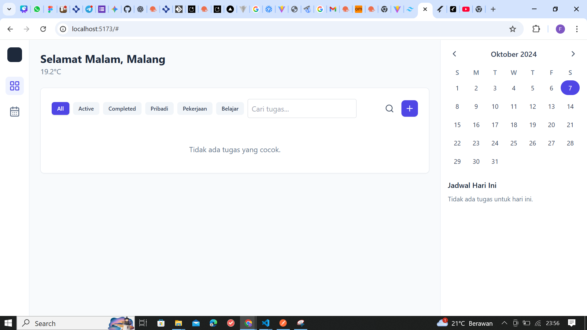
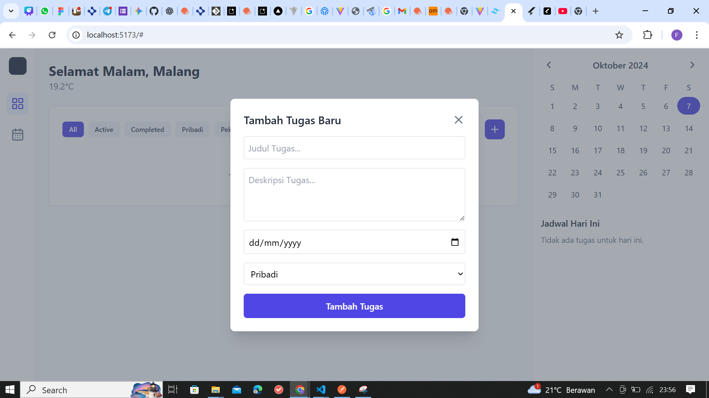

# Dasbor Produktivitas Harian

Ini adalah prototipe aplikasi web to-do list yang dikembangkan sebagai "Dasbor Produktivitas Harian". Aplikasi ini memungkinkan pengguna untuk mengelola tugas harian mereka sambil menampilkan informasi kontekstual seperti waktu lokal, lokasi, dan kondisi cuaca saat ini yang diambil dari API publik.

## Fitur Utama

- **Informasi Kontekstual:** Menampilkan sapaan berdasarkan waktu, kota pengguna, dan ringkasan cuaca saat ini.
- **Manajemen Tugas:** Tambah, hapus, edit, dan tandai tugas sebagai selesai.
- **Kategorisasi Tugas:** Tugas dapat dikategorikan (Pribadi, Pekerjaan, Belajar).
- **Filter & Pencarian:** Filter tugas berdasarkan status (Semua, Aktif, Selesai), kategori, dan kata kunci pencarian.

## Teknologi yang Digunakan

- React.js
- Redux (untuk manajemen state)
- Redux-Saga (untuk side effects seperti pemanggilan API)
- Axios (untuk HTTP requests)

## Instalasi dan Menjalankan Proyek

Untuk menjalankan proyek ini secara lokal, ikuti langkah-langkah berikut:

1.  **Clone repositori:**

    ```bash
    git clone <URL_REPOSITORI_ANDA>
    cd to-do-list-with-reduxsaga
    ```

2.  **Instal dependensi:**

    ```bash
    npm install
    ```

3.  **Jalankan aplikasi:**

    ```bash
    npm run dev
    ```

    Aplikasi akan berjalan di `http://localhost:5173` (atau port lain yang tersedia).

## Screenshot Aplikasi



